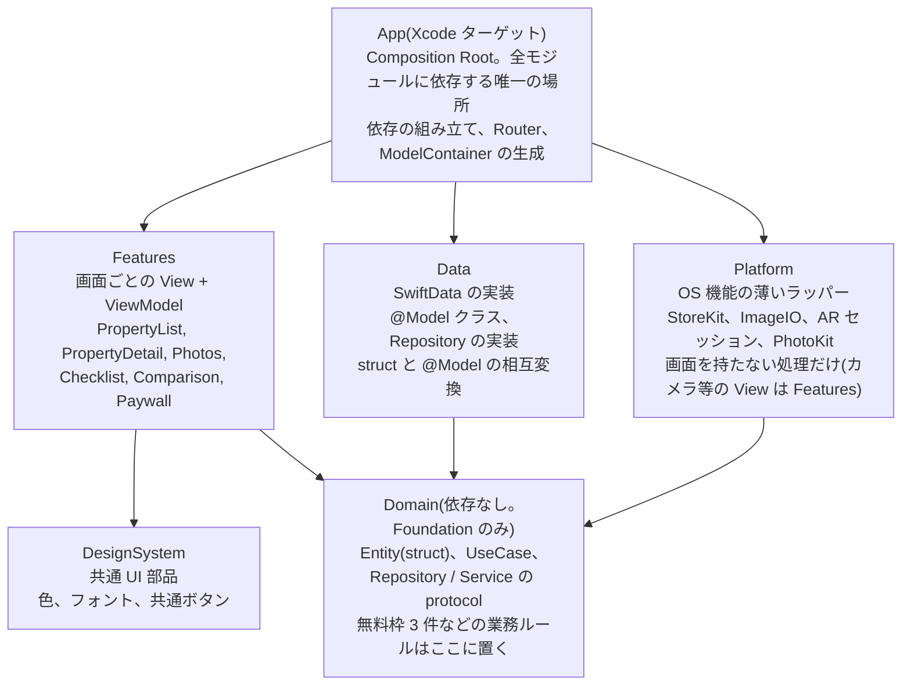
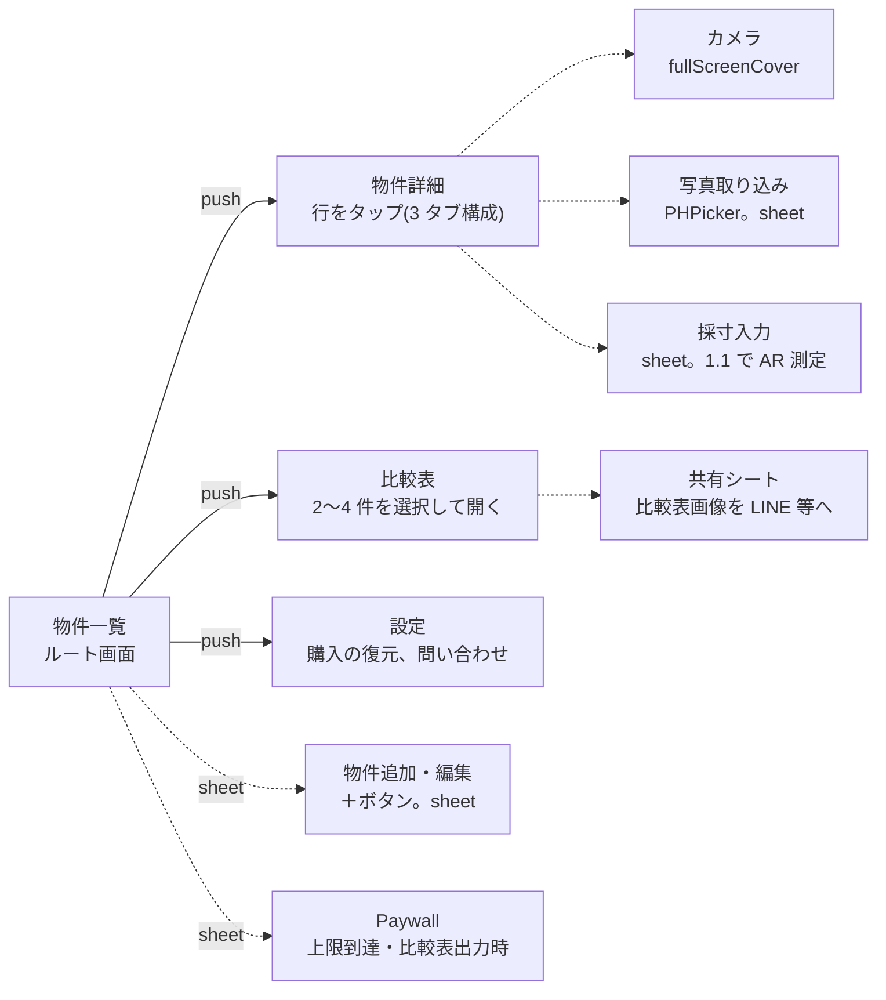
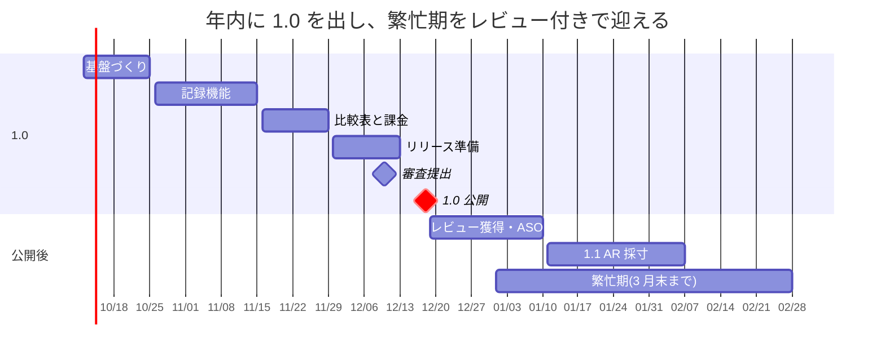

# 内見ノート 設計書

2026-10-09 作成 · 2026-10-10 実装との差分を追記 · @nao

## 1. 概要

**内見ノート**は、部屋探しをする人が内見した物件の写真・採寸・チェック結果を1件ずつまとめ、比較表の画像として家族や同棲相手に共有できるiOSアプリ。サーバを持たず、データは端末ローカルとユーザー自身のiCloudにだけ置く。

### 名称と識別子

| 用途 | 値 | 備考 |
| --- | --- | --- |
| 表示名(App Store・ホーム画面) | 内見ノート | 検索語「内見」をそのまま含める。「メモ」より競合が少なく、ノート=1冊にまとまる印象 |
| サブタイトル(App Store) | 写真・採寸・チェックを1冊に | 30文字以内。検索語「内見 チェックリスト」「内見 メモ」を説明文で補う |
| 英語名 | Naiken Note | 英語ストアでの表記。ローマ字でそのまま |
| Xcodeプロジェクト | NaikenNote |  |
| ローカルパッケージ | NaikenKit | 第4章。短く保つため「Note」を付けない |
| Bundle ID | `com.<yourdomain>.naikennote` | 本書では `com.example.naikennote` と表記 |
| CloudKitコンテナ | `iCloud.com.example.naikennote` | 第8章 |
| 共有画像のクレジット | 内見ノートで作成 | 第9章。比較表画像の右下に入れる |
| リポジトリ(GitHub、private) | naiken-note | 小文字ケバブケース。Xcodeプロジェクト名(NaikenNote)とは揃えない |

「内見ノート」という名前のアプリはApp Store検索で見当たらなかった(2026年10月時点)。審査提出前にApp Store Connectで名前を確保しておく。

| 項目 | 内容 |
| --- | --- |
| 対象 | iOS 17以上、iPhone専用(iPad対応は後回し) |
| 主ユーザー | 部屋探し中の一般ユーザー(toC)。営業向けProは第2フェーズ |
| 収益 | 無料で物件3件まで。4件目以降と比較表出力は買い切り(¥480〜600)。Proは月額サブスク |
| 集客 | ストア内検索(「内見 メモ」「内見 チェックリスト」)と、共有画像に入るアプリ名 |
| 繁忙期 | 1〜3月。年内リリースが前提 |
| 前提 | 自前サーバなし。Apple純正フレームワークのみで構成し、外部ライブラリは原則入れない |

MVPに含めるのは次の4機能だけ。これ以外は第2フェーズに回す。

1. 物件を登録すると、撮った写真がその物件に自動で紐づく
2. 採寸メモを「どこの寸法か」のラベル付きで残す
3. 定型チェックリスト(日当たり・水圧・騒音・収納など)
4. 登録した物件を並べた比較表を画像として書き出す

## 2. 要件

MVPは「1人で内見して、帰ってから比較して、誰かに送る」までを端末内で完結させる。Proと自動化はそのあと。

### 機能要件

| ID | 機能 | フェーズ | 備考 |
| --- | --- | --- | --- |
| F-01 | 物件の登録・編集・削除(名前、家賃、間取り、面積、最寄駅、徒歩分、内見日、メモ) | MVP | 無料は3件まで |
| F-02 | 物件詳細からカメラを起動し、撮った写真をその物件に紐づける | MVP | 写真ライブラリ権限は不要 |
| F-03 | 写真ライブラリから複数選択して物件に取り込む(PHPicker) | MVP | 内見後のまとめ取り込み用 |
| F-04 | 写真に部屋タグ(リビング、キッチン、浴室、玄関、バルコニー等)を付ける | MVP |  |
| F-05 | 採寸メモ(ラベル、ミリ単位の数値、備考、任意で写真)を記録する | MVP | ラベルは定型+自由入力 |
| F-06 | 定型チェックリストに3段階(○△×)とメモを付ける | MVP | 項目は約20個、アプリ側で定義 |
| F-07 | 物件を最大4件並べた比較表を画像として書き出し、共有シートに渡す | MVP | 有料機能。画像にアプリ名を入れる |
| F-08 | iCloudで自動バックアップ・機種変更時の復元 | MVP | CloudKit |
| F-09 | 買い切り課金(4件目以降の登録と比較表出力の解錠) | MVP | StoreKit 2 |
| F-10 | ARKitで2点間の距離を測って採寸メモに入れる | 1.1 | 手入力の代替 |
| F-11 | 内見日時と位置情報で写真ライブラリから自動取り込み | 1.2 | ライブラリ権限が必要になる |
| F-12 | ロック画面・ホーム画面ウィジェット(次の内見予定) | 1.2 |  |
| F-13 | Proモード(件数無制限、顧客別フォルダ、月額サブスク) | 2.0 | 営業向け |

### 非機能要件

| 項目 | 基準 |
| --- | --- |
| 対応OS | iOS 17.0以上(SwiftData、Observationの最低要件) |
| 言語 | Swift 6、Strict Concurrency有効 |
| 外部依存 | 原則なし。入れる場合は設計書に理由を残す |
| サーバ | 持たない。通信はCloudKitとApp Storeのみ |
| プライバシー | 位置情報・写真ライブラリの権限はMVPでは要求しない。カメラのみ |
| 起動 | コールドスタートから物件一覧表示まで1秒以内 |
| オフライン | 全機能が圏外で動く。同期は復帰後にCloudKitが自動で行う |
| 画像 | 保存時に長辺2,048pxへ縮小したJPEG(品質0.8)。1枚あたり概ね500KB以下 |
| アクセシビリティ | Dynamic Typeに追従。VoiceOverで主要操作が完了できる |
| テスト | Domain層とRepository層はユニットテスト必須。UIテストはリリース前の手動確認で代替 |

### 実装で決めたこと(2026-10-10)

この章が決めていなかった仕様を、実装で次のように決めた。

| ID | 決めたこと | 理由 |
| --- | --- | --- |
| F-07 | 比較表の画像は `UIActivityViewController` で共有し、実際に送ったときだけ、比較表の画面を閉じたあとにレビューを頼む | `ShareLink` では共有をやめたかどうかが分からず、送っていなくてもレビューを頼んでしまうため |
| F-11 | 内見日時の前後1時間の写真を候補にし、内見日時にいちばん近い位置情報つきの写真の撮影地点を内見場所とみなす。そこから500mより離れた写真は除き、位置情報のない写真は残す | 住所の入力やジオコーディングの通信を要らなくするため。位置情報を記録しない写真まで除くと、内見で撮った写真が落ちる |
| F-11 | 写真へのアクセスが「制限付き」なら、探せる写真が限られることと設定アプリへの導線を出す。1枚読めなくても残りは取り込み、読めなかった枚数を知らせる | 圏外では iCloud にしかない写真を読めないため |
| F-12 | アプリは起動時とストアが変わるたびに、これからの内見を近い順に最大20件、App Group の UserDefaults に JSON で書く。ウィジェットは内見の時刻ごとにエントリを作る | ウィジェットの読み直しには回数の上限があり、遅れると過ぎた内見を出し続けるため |
| F-12 | ロック画面のインライン表示は、今日でない内見には日付も出す。中サイズは1件1行で3件並べる | 時刻だけだと明日の予定が今日に見え、複数行では3件が収まらないため |
| F-13 | 顧客フォルダの管理は設定から、絞り込みは一覧の左上のメニューから行う。Pro が切れたらメニューと絞り込みを外し、物件と顧客の紐づけは残す | 絞り込みを残すと、メニューが消えたあとユーザーが解除できなくなるため |

## 3. アーキテクチャ方針

SwiftUI + Observation(`@Observable`)によるMVVMを土台に、Domain / Data / Platform の3層をSwiftPMのローカルパッケージで分離する。依存は常に外側から内側へ(View → ViewModel → UseCase → Repository protocol)。SwiftDataの`@Model`はData層に閉じ込め、それより上の層はプレーンな`struct`しか知らない。

### 採用技術

| 領域 | 採用 | 理由 |
| --- | --- | --- |
| UI | SwiftUI | iOS 17以降のみ対応なので制約が少ない |
| 状態管理 | Observation(`@Observable`) | `ObservableObject`より再描画が少なく、ボイラープレートが減る |
| 永続化 | SwiftData | CloudKit同期が設定ほぼ1行 |
| 同期 | CloudKit(private database) | サーバ不要。データは本人のiCloudにしか置かない |
| 並行処理 | Swift Concurrency(async/await、actor) | Swift 6のStrict Concurrencyでデータ競合をコンパイル時に排除 |
| 課金 | StoreKit 2 | async/awaitで扱える。レシート検証サーバが不要 |
| 画像書き出し | `ImageRenderer` | SwiftUIのViewをそのまま画像化できる |
| DI | イニシャライザ注入 + `@Environment` | ライブラリ不要。Composition RootはAppターゲットに1か所 |
| テスト | Swift Testing | Xcode 16以降の標準。`@Test`と`#expect` |

### 設計原則

1. ViewはViewModelの状態を描画するだけ。分岐ロジック、永続化、画像処理をViewに書かない
2. ViewModelは`@MainActor @Observable final class`。UseCaseを呼び、結果を表示用の状態に変換する
3. UseCaseは1つの操作を表す`struct`または`protocol`。Repositoryとサービスを組み合わせ、業務ルール(無料枠3件など)を持つ
4. Repositoryは`protocol`をDomain層で定義し、実装をData層に置く。戻り値はDomainの`struct`
5. `@Model`クラスはData層の外に出さない。ViewやViewModelは`Property`(struct)だけを扱う
6. 画面を持たないOS機能(画像処理、StoreKit、ARセッション、PhotoKit)はDomainの`protocol`で抽象化し、実装をPlatform層に置く。テストではモックに差し替える
7. 画面を伴うOS機能(カメラ、フォトピッカー、ARの表示)はViewなのでFeatures層に置き、結果を`Data`や数値でViewModelに渡す
8. グローバル変数・シングルトンを作らない。共有が必要なものはAppターゲットで生成して注入する

### 検討したが採用しなかった選択肢

| 選択肢 | 不採用の理由 |
| --- | --- |
| TCA(The Composable Architecture) | 学習コストと依存の重さが個人開発に見合わない。Swift 6対応も追従負荷が高い |
| `@Query`をViewで直接使う | 手早いがViewがSwiftDataに密結合し、無料枠判定などの業務ルールの置き場がなくなる |
| Clean Architecture(Presenter / Interactor / Entity Gateway) | 層が多すぎて1人では回らない。UseCase + Repositoryで責務分離は足りる |
| Core Data + NSPersistentCloudKitContainer | SwiftDataで同じことができ、記述量が1/3で済む |
| 単一モジュール | ビルド時間は問題にならないが、依存方向を型で縛れないため層の侵食が起きやすい |

## 4. モジュール構成

Xcodeプロジェクト直下にローカルSwiftPMパッケージ `NaikenKit` を1つ置き、その中に5つのターゲットを切る。Appターゲットだけが全部をimportできる。



*依存は外側から内側へ。Domain は何にも依存しない*

矢印は「依存する → される」の向き。FeaturesはDataを知らず、DataとPlatformは互いを知らない。この制約はPackage.swiftの`dependencies`で機械的に守られる。

| ターゲット | import してよいもの | 置いてはいけないもの |
| --- | --- | --- |
| Domain | Foundation | SwiftUI、SwiftData、UIKit |
| Data | Domain、SwiftData | SwiftUI、View |
| Platform | Domain、ImageIO、StoreKit、ARKit、Photos | SwiftData、View(SwiftUI・UIKitとも) |
| DesignSystem | SwiftUI | Domain(表示部品は業務を知らない) |
| Features | Domain、DesignSystem、SwiftUI、PhotosUI、UIKit(`Representable`のラップ用) | Data、Platform、SwiftData |
| App | すべて | 業務ロジック(組み立てだけ) |

フォルダは `NaikenKit/Sources/<ターゲット名>/` に置き、Featuresの中は `PropertyList/`、`PropertyDetail/` のように画面単位で切る。画面が増えてビルドが重くなったら、その時点でFeaturesを画面ごとのターゲットに分割する。

### 実装で変えたところ(2026-10-10)

import してよいフレームワークは、上の表より次の分だけ広い。どれも `.swiftlint.yml` の `custom_rules` で縛っている。

| 対象 | 足したもの | 使い道 |
| --- | --- | --- |
| Data | CoreData | リモート変更通知の名前だけ |
| Platform | UniformTypeIdentifiers、CloudKit、CoreLocation、WidgetKit | JPEG の型の指定、iCloud のアカウント状態、写真の位置情報、ウィジェットの再読み込み |
| DesignSystem | UIKit | ダークモードに追従する色とサムネイルの復号 |
| Features | Observation、ARKit、SceneKit、StoreKit | ViewModel の観測、AR の表示、レビュー依頼 |
| Features の ViewModel | Foundation、Observation、Domain だけ | SwiftUI・UIKit に頼ると画面なしでテストできないため |
| ウィジェット | Foundation、SwiftUI、WidgetKit、Domain、DesignSystem だけ | SwiftData のストアを開かないため |

- 規則は `internal import` などアクセスレベル付きの import、字下げした import、`import struct X.Y` も検出する。CI は、Features から Data をこれらの書き方で import すると失敗することを毎回確かめる
- `Router` と `EntitlementStore` は App ではなく Features の `Shared/` に置いた。`Router` は View が `@Environment` で参照し、`EntitlementStore` は ViewModel が `EntitlementState` プロトコル越しに参照するため。どの View を作るかは引き続き App の `AppContainer+Views` だけが知っている

## 5. データモデル

Domain層の`struct`(Property、Photo、Measurement、CheckResult)と、Data層の`@Model`クラス(末尾に`Record`)を1対1で対応させる。アプリ本体が触るのは`struct`だけで、`Record`はRepositoryの内側にしか現れない。

| Entity | 主なフィールド | 関係 |
| --- | --- | --- |
| Property | id, name, rent(円), layout(間取り), areaSquareMeters, nearestStation, walkMinutes, visitedAt, memo, createdAt | Photo・Measurement・CheckResultを1対多で持つ。削除時はcascade |
| Photo | id, imageData(縮小済みJPEG), thumbnailData, roomTag, caption, takenAt, sortOrder | Propertyに属する |
| Measurement | id, label, valueMillimeters, note, createdAt | Propertyに属する。任意でPhotoを1枚参照 |
| CheckResult | id, itemKey, rating(○△×), note | Propertyに属する。itemKeyは`CheckItemCatalog`の定義を指す |
| CheckItem | id, title, category | 永続化しない。Domain層に定数として定義(約20項目) |

### Domain層の定義(抜粋)

```swift
public struct Property: Identifiable, Hashable, Sendable {
    public let id: UUID
    public var name: String
    public var rent: Int?
    public var layout: String
    public var areaSquareMeters: Double?
    public var nearestStation: String
    public var walkMinutes: Int?
    public var visitedAt: Date
    public var memo: String
    public var photos: [Photo]
    public var measurements: [Measurement]
    public var checkResults: [CheckResult]
    public let createdAt: Date
}

public struct Photo: Identifiable, Hashable, Sendable {
    public enum RoomTag: String, CaseIterable, Sendable {
        case living, kitchen, bathroom, toilet, entrance, balcony, storage, exterior, other
    }

    public let id: UUID
    public var roomTag: RoomTag
    public var caption: String
    public var takenAt: Date
    public var sortOrder: Int
}

public struct CheckResult: Identifiable, Hashable, Sendable {
    public enum Rating: Int, CaseIterable, Sendable {
        case bad = 1
        case neutral = 2
        case good = 3
    }

    public let id: UUID
    public let itemKey: String
    public var rating: Rating?
    public var note: String
}
```

`RoomTag`や`Rating`は`PhotoRoomTag`のような階層名にせず、親の型にネストする(スタイルガイド「命名」の規則)。画像の`Data`はDomainの`Photo`に持たせず、必要な画面だけがRepository経由で取り出す。

`public struct`のmemberwise initはモジュール外から呼べないので、`public init`を明示する。省略可能なフィールド(`rent`、`memo`、各配列など)にはデフォルト引数を与え、第6章の`Property(id:name:visitedAt:createdAt:)`のように短く生成できるようにする。

### Data層の定義(抜粋)

```swift
@Model
final class PropertyRecord {
    var id: UUID = UUID()
    var name: String = ""
    var rent: Int?
    var layout: String = ""
    var areaSquareMeters: Double?
    var nearestStation: String = ""
    var walkMinutes: Int?
    var visitedAt: Date = Date()
    var memo: String = ""
    var createdAt: Date = Date()

    @Relationship(deleteRule: .cascade, inverse: \PhotoRecord.property)
    var photos: [PhotoRecord]? = []

    @Relationship(deleteRule: .cascade, inverse: \MeasurementRecord.property)
    var measurements: [MeasurementRecord]? = []

    @Relationship(deleteRule: .cascade, inverse: \CheckResultRecord.property)
    var checkResults: [CheckResultRecord]? = []

    init(id: UUID = UUID(), name: String, visitedAt: Date) {
        self.id = id
        self.name = name
        self.visitedAt = visitedAt
    }
}

@Model
final class PhotoRecord {
    var id: UUID = UUID()
    @Attribute(.externalStorage) var imageData: Data?
    @Attribute(.externalStorage) var thumbnailData: Data?
    var roomTag: String = Photo.RoomTag.other.rawValue
    var caption: String = ""
    var takenAt: Date = Date()
    var sortOrder: Int = 0
    var property: PropertyRecord?

    init(roomTag: Photo.RoomTag, takenAt: Date) {
        self.roomTag = roomTag.rawValue
        self.takenAt = takenAt
    }
}
```

### CloudKit同期のための制約

SwiftDataをCloudKitと組み合わせると、モデル定義に次の制約がかかる。違反すると実行時にコンテナ生成が失敗する。

- すべての保存プロパティにデフォルト値を与えるか、オプショナルにする
- `@Attribute(.unique)`は使えない。重複排除は`id`でアプリ側が行う
- リレーションは必ずオプショナル(`[PhotoRecord]?`)にし、`inverse`を明示する
- 削除ルールに`.deny`は使えない。`.cascade`か`.nullify`を使う
- `enum`は直接保存せず、`rawValue`の`String`または`Int`で持つ(上の`roomTag`)
- 画像は`@Attribute(.externalStorage)`の`Data`にする。CloudKit側では`CKAsset`として同期される
- リリース後のスキーマ変更は追加のみ。フィールドの改名・型変更・削除はしない。1.0時点から`VersionedSchema`で`SchemaV1`を切っておく

### 実装で変えたところ(2026-10-10)

- 並び順は業務ルールとして Domain で決める。`Property` の init が写真(並び順 → 撮影日時 → id)と採寸(登録日時 → id)を並べ、`FetchPropertiesUseCase` が物件を内見日時の新しい順に、`FetchCustomersUseCase` が顧客を名前順に並べる。Data の Repository は並べない
- 写真の並び順の値だけで比べないのは、2台の端末で同期前に写真を足すと同じ値の写真ができ、読み込むたびに代表写真が入れ替わるため
- `CheckResult` は項目ごとに1件だけ持つ(`CheckResult.onePerItem`)。CloudKit では一意制約を付けられず、2台で同じ項目を評価すると同じ項目の結果が2件届き、○の数を数え違えるため。余分なレコードは、その項目を次に保存したときに Data が消す
- チェック項目のカテゴリ名(「環境」など)は Features に置いた。部屋タグや評価の表示名と同じ置き場で、Domain には保存キーと対になる項目名だけを残す
- SchemaV1 には 2.0 の顧客フォルダ用の `CustomerRecord` を最初から入れた。公開後のスキーマ移行を避けるため
- ウィジェットに渡す `UpcomingVisit` は、物件 ID・名前・内見日時・最寄駅だけを持つ(徒歩分は表示しないので持たない)

## 6. レイヤー別の責務

「物件を追加する」操作を例に、各レイヤーが何を持ち、何を持たないかを示す。無料枠の判定はUseCaseにあり、ViewにもRepositoryにもない。

| レイヤー | 型の形 | 持つもの | 持たないもの |
| --- | --- | --- | --- |
| View | `struct: View` | 描画、ユーザー操作をViewModelのメソッドに渡す。カメラやピッカーなど画面を伴うOS機能のラップ | `if`による業務分岐、永続化、画像処理 |
| ViewModel | `@MainActor @Observable final class` | 画面の状態、入力検証、UseCase呼び出し、エラーの表示用変換 | SwiftData、UIKit、ナビゲーション先の生成 |
| UseCase | `struct` + `protocol` | 業務ルール(無料枠、並び順、画像縮小の指示) | UIの知識、具体的なストレージ |
| Repository | `protocol`はDomain、実装はData | `Record`と`struct`の変換、`ModelContext`の操作 | 業務ルール |
| Service | `protocol`はDomain、実装はPlatform | 画像処理、StoreKit、ARセッション、PhotoKit走査 | 永続化、業務ルール、View |

### Domain層: Repository protocol と UseCase

```swift
public protocol PropertyRepository: Sendable {
    func fetchAll() async throws -> [Property]
    func fetch(id: UUID) async throws -> Property?
    func count() async throws -> Int
    func save(_ property: Property) async throws
    func delete(id: UUID) async throws
}

public protocol EntitlementProvider: Sendable {
    var current: Entitlement { get async }
}

public enum Entitlement: Sendable {
    case free
    case unlocked
    case pro

    var propertyLimit: Int? {
        switch self {
        case .free:
            return 3
        case .unlocked, .pro:
            return nil
        }
    }
}

public struct AddPropertyUseCase: Sendable {
    public enum Failure: Error, Equatable {
        case limitReached(limit: Int)
    }

    private let repository: any PropertyRepository
    private let entitlement: any EntitlementProvider

    public init(repository: any PropertyRepository, entitlement: any EntitlementProvider) {
        self.repository = repository
        self.entitlement = entitlement
    }

    public func execute(name: String, visitedAt: Date) async throws -> Property {
        if let limit = await entitlement.current.propertyLimit {
            let count = try await repository.count()
            if count >= limit {
                throw Failure.limitReached(limit: limit)
            }
        }
        let property = Property(
            id: UUID(),
            name: name,
            visitedAt: visitedAt,
            createdAt: Date()
        )
        try await repository.save(property)
        return property
    }
}
```

`Failure`は`AddPropertyUseCaseError`ではなく型の中にネストする。`guard`はオプショナルバインディングのときだけ使い、`count >= limit`のような条件には`if`を使う(スタイルガイド「オプショナル」)。

### Data層: Repository 実装

```swift
@ModelActor
actor SwiftDataPropertyRepository: PropertyRepository {
    func fetchAll() throws -> [Property] {
        let descriptor = FetchDescriptor<PropertyRecord>(
            sortBy: [SortDescriptor(\.visitedAt, order: .reverse)]
        )
        return try modelContext.fetch(descriptor).map(Property.init(record:))
    }

    func count() throws -> Int {
        return try modelContext.fetchCount(FetchDescriptor<PropertyRecord>())
    }

    func save(_ property: Property) throws {
        let record = try existingRecord(id: property.id) ?? PropertyRecord(
            id: property.id,
            name: property.name,
            visitedAt: property.visitedAt
        )
        record.apply(property)
        modelContext.insert(record)
        try modelContext.save()
    }

    private func existingRecord(id: UUID) throws -> PropertyRecord? {
        var descriptor = FetchDescriptor<PropertyRecord>(predicate: #Predicate { $0.id == id })
        descriptor.fetchLimit = 1
        return try modelContext.fetch(descriptor).first
    }
}
```

`@ModelActor`で`ModelContext`をactorに閉じ込めるので、ViewModelからは`await`で呼ぶだけでスレッド安全になる。`struct`と`Record`の変換は`Property.init(record:)`と`PropertyRecord.apply(_:)`の2つのextensionに集約し、Data層の外には出さない。

### Features層: ViewModel と View

```swift
@MainActor
@Observable
final class PropertyListViewModel {
    enum Notice {
        case limitReached(limit: Int)
        case failed(message: String)
    }

    private(set) var properties: [Property] = []
    private(set) var isLoading = false
    var notice: Notice?

    var isNoticePresented: Bool {
        get {
            return notice != nil
        }
        set {
            if !newValue {
                notice = nil
            }
        }
    }

    private let fetchProperties: FetchPropertiesUseCase
    private let addProperty: AddPropertyUseCase

    init(fetchProperties: FetchPropertiesUseCase, addProperty: AddPropertyUseCase) {
        self.fetchProperties = fetchProperties
        self.addProperty = addProperty
    }

    func load() async {
        isLoading = true
        defer { isLoading = false }
        do {
            properties = try await fetchProperties.execute()
        } catch {
            notice = .failed(message: error.localizedDescription)
        }
    }

    func add(name: String) async {
        do {
            _ = try await addProperty.execute(name: name, visitedAt: Date())
            await load()
        } catch AddPropertyUseCase.Failure.limitReached(let limit) {
            notice = .limitReached(limit: limit)
        } catch {
            notice = .failed(message: error.localizedDescription)
        }
    }
}

struct PropertyListView: View {
    @State private var viewModel: PropertyListViewModel
    @Environment(Router.self) private var router

    init(viewModel: PropertyListViewModel) {
        _viewModel = State(initialValue: viewModel)
    }

    var body: some View {
        List(viewModel.properties) { property in
            Button {
                router.push(.propertyDetail(id: property.id))
            } label: {
                PropertyRow(property: property)
            }
        }
        .overlay { if viewModel.isLoading { ProgressView() } }
        .task { await viewModel.load() }
        .alert(
            "確認",
            isPresented: $viewModel.isNoticePresented,
            presenting: viewModel.notice
        ) { notice in
            if case .limitReached = notice {
                Button("解除する") { router.present(.paywall) }
            }
            Button("閉じる", role: .cancel) {}
        } message: { notice in
            switch notice {
            case .limitReached(let limit):
                Text("無料版で登録できるのは\(limit)件までです")
            case .failed(let message):
                Text(message)
            }
        }
    }
}
```

Viewは`viewModel.properties`を描くだけで、件数の上限を知らない。上限に達したことはUseCaseが`Failure`で伝え、ViewModelが表示用の`Notice`に変換し、Viewはそれをアラートとして表示する。この3段の分離があると、無料枠を3件から5件に変える変更はDomain層の1行で済む。

ViewModelの`init`は依存を保持するだけにし、読み込みは`load()`で行う。`navigationDestination`や`sheet`のクロージャはSwiftUIが再評価することがあり、`State(initialValue:)`は最初の1回しか採用されないため、`init`に副作用があると捨てられるインスタンスでも走ってしまう。

### App層: Composition Root

```swift
@main
struct NaikenApp: App {
    private let container: AppContainer

    init() {
        do {
            container = try AppContainer()
        } catch {
            fatalError("ModelContainer の生成に失敗: \(error)")
        }
    }

    var body: some Scene {
        WindowGroup {
            RootView(container: container)
                .environment(container.router)
                .environment(container.entitlementStore)
        }
    }
}

@MainActor
final class AppContainer {
    let router = Router()
    let entitlementStore: EntitlementStore
    let propertyRepository: any PropertyRepository

    init() throws {
        let modelContainer = try ModelContainerFactory.make()
        propertyRepository = SwiftDataPropertyRepository(modelContainer: modelContainer)
        entitlementStore = EntitlementStore(purchaseService: StoreKitPurchaseService())
    }

    func makePropertyListViewModel() -> PropertyListViewModel {
        return PropertyListViewModel(
            fetchProperties: FetchPropertiesUseCase(repository: propertyRepository),
            addProperty: AddPropertyUseCase(repository: propertyRepository, entitlement: entitlementStore)
        )
    }
}
```

依存の組み立てはすべて`AppContainer`に集める。ここだけがData層とPlatform層の具象型を知っている。`fatalError`はこの1か所に限り許容する(永続化が立ち上がらない状態でアプリを動かす意味がないため)。

### 実装で変えたところ(2026-10-10)

- Data が公開するのは `SwiftDataRepositories.make()` と `cloudKitContainerID` だけにした。`ModelContainerFactory` は internal で、App は ModelContainer を直接触らない
- `PropertyRepository` に `fetchAll(visitedAfter:)` を足した。起動直後のウィジェット更新で、これからの内見の物件だけを読むため
- 並び順は UseCase で決め、Data では並べ替えない(`FetchPropertiesUseCase` は内見日時の新しい順、`FetchCustomersUseCase` も UseCase で並べる)
- 保存は `ModelContext.commit()` に集めた。save に失敗したら rollback し、成功したときだけローカルの変更を通知する
- ウィジェット更新の常駐ループは AppContainer から `KeepUpcomingVisitsUpdatedUseCase` に移し、テストできるようにした
- 物件の追加・更新の UseCase(`UpdatePropertyUseCase(repository:entitlement:)` など)は、顧客を設定・変更するときに Pro を確かめ、なければ `.proRequired` で失敗する。顧客を変えない更新は Pro がなくても通す
- Features の ViewModel は `EntitlementStore` ではなく `EntitlementState` protocol を受け取る。App は EntitlementStore を environment に入れない
- View は状態を直接書き換えず、ViewModel の動詞を呼ぶ(`startSelecting`、`selectTag`、`select(_:)` など)

## 7. 画面構成と遷移

画面は10個。`NavigationStack`の`path`、`sheet`、`fullScreenCover`の3つを`Router`が一元管理し、Viewは`router.push(.propertyDetail(id:))`のように遷移先を名前で指定する。どのViewを生成するかはApp層だけが知っている。



*物件一覧を起点に、push は 3 画面、モーダルは 6 画面。実線は push(NavigationStack)、点線は sheet / fullScreenCover / システム UI*

物件詳細は「写真」「採寸」「チェック」の3タブを持ち、カメラ・取り込み・採寸入力はすべてここから開く。チェックタブは詳細画面内で完結し、別画面にはしない。写真取り込みだけはPhotosPickerが自前でsheetを出す仕組みなので、Routerを通らず、図では便宜上モーダルとして描いている。

### Router

```swift
@MainActor
@Observable
final class Router {
    enum Route: Hashable {
        case propertyDetail(id: UUID)
        case comparison(ids: [UUID])
        case settings
    }

    enum Sheet: Identifiable {
        case propertyEditor(id: UUID?)
        case measurementEditor(propertyID: UUID, id: UUID?)
        case paywall

        var id: String {
            switch self {
            case .propertyEditor(let id):
                return "propertyEditor-\(id?.uuidString ?? "new")"
            case .measurementEditor(let propertyID, let id):
                return "measurementEditor-\(propertyID)-\(id?.uuidString ?? "new")"
            case .paywall:
                return "paywall"
            }
        }
    }

    enum FullScreen: Identifiable {
        case camera(propertyID: UUID)

        var id: String {
            switch self {
            case .camera(let propertyID):
                return "camera-\(propertyID)"
            }
        }
    }

    var path: [Route] = []
    var sheet: Sheet?
    var fullScreen: FullScreen?

    func push(_ route: Route) {
        path.append(route)
    }

    func pop() {
        _ = path.popLast()
    }

    func present(_ sheet: Sheet) {
        self.sheet = sheet
    }

    func presentFullScreen(_ screen: FullScreen) {
        fullScreen = screen
    }

    func dismiss() {
        sheet = nil
        fullScreen = nil
    }
}
```

### RootView(App層)

```swift
struct RootView: View {
    @Environment(Router.self) private var router

    private let container: AppContainer

    init(container: AppContainer) {
        self.container = container
    }

    var body: some View {
        @Bindable var router = router
        NavigationStack(path: $router.path) {
            PropertyListView(viewModel: container.makePropertyListViewModel())
                .navigationDestination(for: Router.Route.self) { route in
                    container.makeView(for: route)
                }
        }
        .sheet(item: $router.sheet) { sheet in
            container.makeView(for: sheet)
        }
        .fullScreenCover(item: $router.fullScreen) { screen in
            container.makeView(for: screen)
        }
    }
}
```

`AppContainer`は`@Observable`ではないので`@Environment`には乗せず、`RootView`のイニシャライザで渡す。`makeView(for:)`は`Route`・`Sheet`・`FullScreen`それぞれに対するオーバーロードで、App層にだけ存在する。

`Route`を`Hashable`な`enum`にしておくと、遷移先の追加漏れが`switch`の網羅性チェックでコンパイルエラーになる。`Sheet`の`id`が引数を含むのは、同じsheetを別の物件で開き直したときSwiftUIが再生成してくれるようにするため。

### 実装で変えたところ(2026-10-10)

- `Router` に `stackedSheet` を足した。シートを開いているときの `present` は、その上に重ねて開く。`dismiss` は重ねたほうから閉じる
- RootView はシートの中に `.sheet(item: $router.stackedSheet)` を入れ子にして出す
- 理由: 物件の編集画面から Paywall を開くとき、編集画面を閉じると入力中の内容が消えるため。重ねて開けば、購入後にそのまま入力を続けられる

## 8. 永続化と同期

`ModelConfiguration`に`cloudKitDatabase: .private(...)`を渡すだけで、SwiftDataがCloudKitのプライベートデータベースと自動同期する。アプリはローカルストアだけを読み書きし、同期の完了を待たない。iCloudに未サインインでもローカルだけで全機能が動く。

### ModelContainer の生成(Data層)

```swift
public enum ModelContainerFactory {
    public static func make(inMemory: Bool = false) throws -> ModelContainer {
        let schema = Schema(versionedSchema: SchemaV1.self)
        let configuration = ModelConfiguration(
            schema: schema,
            isStoredInMemoryOnly: inMemory,
            cloudKitDatabase: inMemory ? .none : .private("iCloud.com.example.naikennote")
        )
        return try ModelContainer(
            for: schema,
            migrationPlan: NaikenMigrationPlan.self,
            configurations: [configuration]
        )
    }
}

enum SchemaV1: VersionedSchema {
    static let versionIdentifier = Schema.Version(1, 0, 0)

    static var models: [any PersistentModel.Type] {
        return [PropertyRecord.self, PhotoRecord.self, MeasurementRecord.self, CheckResultRecord.self]
    }
}

enum NaikenMigrationPlan: SchemaMigrationPlan {
    static var schemas: [any VersionedSchema.Type] {
        return [SchemaV1.self]
    }

    static var stages: [MigrationStage] {
        return []
    }
}
```

`inMemory: true`はテストとSwiftUIプレビュー用。CloudKitを切り、ディスクにも書かない。

### 必要な設定

| 場所 | 設定 |
| --- | --- |
| Signing & Capabilities | iCloud → CloudKit にチェック。コンテナ `iCloud.com.example.naikennote` を作成 |
| Signing & Capabilities | Background Modes → Remote notifications(同期の起点になるサイレントプッシュ用) |
| CloudKit Console | リリース前に Development のスキーマを Production へデプロイする。忘れるとTestFlight配布後に同期が無言で失敗する |
| Info.plist | `NSCameraUsageDescription`(カメラ)。写真ライブラリの権限文言はMVPでは不要 |

### 他端末からの変更の反映

Viewで`@Query`を使わない設計なので、同期で届いた変更は自分で拾う。CloudKitからの取り込みは内部で`NSPersistentStoreRemoteChange`通知として現れるため、Data層でこれを`AsyncStream`に包み、ViewModelが購読して再読み込みする。

```swift
public final class StoreChangeObserver: Sendable {
    public init() {}

    public var changes: AsyncStream<Void> {
        return AsyncStream { continuation in
            nonisolated(unsafe) let token = NotificationCenter.default.addObserver(
                forName: .NSPersistentStoreRemoteChange,
                object: nil,
                queue: nil
            ) { _ in
                continuation.yield()
            }
            continuation.onTermination = { _ in
                NotificationCenter.default.removeObserver(token)
            }
        }
    }
}
```

ViewModel側はStoreChangeObserverを注入され、`.task`の中で`for await _ in observer.changes { await load() }`と書くだけ。画面を離れると`.task`がキャンセルされ、`onTermination`で購読が外れる。通知は短時間に連続して届くので、`load()`の先頭で300ms程度のデバウンスを入れる。

### 競合と削除

- 競合はCloudKit側のフィールド単位の後勝ち。1人で複数端末を使う前提なので、これで足りる
- 削除は`.cascade`で子レコードごと消え、同期先でも同じく消える。ゴミ箱機能はMVPでは持たない
- 画像1枚は縮小後500KB前後。1物件あたり50枚でも25MBで、ユーザーのiCloud容量を圧迫しない

### 失敗したときの見え方

同期エラーはユーザーに見せない(見せても対処できない)。設定画面に「iCloud同期: 有効 / iCloudにサインインしていません」の状態表示だけ置く。状態は`FileManager.default.ubiquityIdentityToken`の有無で判定する。

### 実装で変えたところ(2026-10-10)

- iCloud の状態は `ubiquityIdentityToken` ではなく、`CKContainer(identifier:).accountStatus()` で調べる(`CloudKitAccountStatusProvider(containerID:)`)。ubiquityIdentityToken は iCloud Drive の状態で、CloudKit が使えるかどうかとは一致しないため
- 状態は「同期中(enabled)」「サインインしていない(signedOut)」「使えない(unavailable)」の 3 つ。制限や一時的に使えないときは unavailable にする
- 保存に失敗したら rollback し、画面に残った変更が次の保存に混ざらないようにした
- 同期で CheckResult が同じ itemKey で重複したときは、書き込みのときに Data が重複を消す。読む側も Domain の `CheckResult.onePerItem` で 1 項目 1 件に絞る

## 9. 周辺サービス

画面を持たないOS機能はDomain層の`protocol`越しに使い、実装はPlatform層に置く。画面を伴うもの(カメラ、フォトピッカー、ARの表示)はFeatures層のViewとして持ち、結果だけをViewModelに渡す。どちらもUseCaseとViewModelはモックに差し替えてテストできる。

| 機能 | 置き場 | 実装 | フェーズ |
| --- | --- | --- | --- |
| カメラ撮影 | Features/Photos(View) | `CameraView`。`UIImagePickerController`(sourceType `.camera`)を`UIViewControllerRepresentable`でラップし、撮影結果を`Data`で返す | MVP |
| 写真の複数取り込み | Features/Photos(View) | `PhotosPicker`(PhotosUI)。`PhotosPickerItem.loadTransferable(type: Data.self)`で`Data`にする。権限不要 | MVP |
| 画像処理 `ImageProcessor` | protocol: Domain / 実装: Platform | `CoreGraphicsImageProcessor`。長辺2,048pxへ縮小、サムネイル生成、EXIFの撮影日時取得 | MVP |
| 比較表の画像化 `ComparisonExporter` | protocol: Domain / 実装: Features/Comparison | `ImageRendererComparisonExporter`。SwiftUI Viewを描くためFeaturesに置く | MVP |
| 課金 `PurchaseService` | protocol: Domain / 実装: Platform | `StoreKitPurchaseService`(第10章) | MVP |
| AR採寸 | View: Features/Measurement、計算: Platform | `ARMeasureSession`がARKitのraycastで2点間距離を求め、`ARMeasureView`が`ARView`を表示する | 1.1 |
| ライブラリ走査 `PhotoLibraryScanner` | protocol: Domain / 実装: Platform | `PhotoKitLibraryScanner`。内見日時の前後1時間の写真を列挙 | 1.2 |

画面を伴うOS機能はViewなのでFeaturesに置き、Platformには画面を持たない処理だけを置く。カスタムの`AVCaptureSession`による連写カメラは、`UIImagePickerController`で不満が出てから(1.2以降)検討する。

### 写真の取り込み(MVP)

「自動で紐づく」はMVPでは「物件詳細から撮れば自動でその物件に入る」の意味で実装する。ライブラリ権限なしで成立し、審査でも揉めない。

1. 物件詳細 → カメラ(`fullScreenCover`)。撮影のたびに`CameraView`が`Data`を返し、ViewModelが`AddPhotoUseCase`に渡す(縮小・サムネイル生成・保存)
2. 内見後のまとめ取り込みは`PhotosPicker`で複数選択。`PhotosPickerItem`ごとに`Data`を取り出し、同じUseCaseに流す
3. 撮影日時は画像のEXIFから取る。EXIFがなければ取り込み時刻にする

```swift
public protocol ImageProcessor: Sendable {
    func downsized(_ data: Data, maxPixelSize: Int) async throws -> Data
    func thumbnail(_ data: Data, maxPixelSize: Int) async throws -> Data
    func captureDate(of data: Data) -> Date?
}

public struct AddPhotoUseCase: Sendable {
    private let repository: any PhotoRepository
    private let processor: any ImageProcessor

    public init(repository: any PhotoRepository, processor: any ImageProcessor) {
        self.repository = repository
        self.processor = processor
    }

    public func execute(propertyID: UUID, original: Data, roomTag: Photo.RoomTag) async throws -> Photo {
        async let image = processor.downsized(original, maxPixelSize: 2_048)
        async let thumbnail = processor.thumbnail(original, maxPixelSize: 320)
        let takenAt = processor.captureDate(of: original) ?? Date()
        let photo = Photo(id: UUID(), roomTag: roomTag, caption: "", takenAt: takenAt, sortOrder: 0)
        try await repository.save(photo, imageData: image, thumbnailData: thumbnail, propertyID: propertyID)
        return photo
    }
}
```

縮小とサムネイル生成は`async let`で並行に走らせる。`CoreGraphicsImageProcessor`は`CGImageSourceCreateThumbnailAtIndex`を使い、元画像をメモリに全展開しない。

### 比較表の書き出し(MVP、有料)

比較表は`ComparisonTableView`というSwiftUIのViewとして実装し、画面表示と画像書き出しで同じViewを使う。書き出し時は`ImageRenderer`に渡し、`scale = 3`でRetina相当のPNG `Data`を得る。Domainの`protocol`は`Data`しか返さないので、`UIImage`がDomainに漏れない。

```swift
// Domain 層
public protocol ComparisonExporter: Sendable {
    @MainActor
    func export(_ properties: [Property]) -> Data?
}

// Features/Comparison
public struct ImageRendererComparisonExporter: ComparisonExporter {
    public init() {}

    @MainActor
    public func export(_ properties: [Property]) -> Data? {
        let renderer = ImageRenderer(content: ComparisonTableView(properties: properties, showsBranding: true))
        renderer.scale = 3
        return renderer.uiImage?.pngData()
    }
}
```

- 列は物件、行は家賃・間取り・面積・駅徒歩・チェック結果の○の数・代表写真1枚
- 右下に「内見ノートで作成」と小さく入れる(`showsBranding`)。これが唯一の広告
- `ExportComparisonUseCase`が解錠状態を確認してから`export`を呼ぶ。未解錠なら`Failure.locked`を投げ、ViewModelがPaywallを開く
- 得られた`Data`は`Image(uiImage:)`に変換して`ShareLink`に渡す。LINE・AirDrop・保存はOS側が面倒を見る
- 4件を超える比較はスマホの横幅で読めないので、選択UI側で4件に制限する

### ARKit採寸(1.1)

Platform層の`ARMeasureSession`が`ARSession`の開始・raycast・2点間の距離計算を担い、Features層の`ARMeasureView`が`ARView`の表示と2点のタップを担う。ViewModelが受け取るのはミリ単位の`Int`だけで、ARKitの型はDomainにもViewModelにも漏らさない。LiDAR非搭載機でも動くが精度が落ちるので、結果画面で「手で測った値に修正できる」導線を必ず付ける。

### 実装で変えたところ(2026-10-10)

- AR の表示は RealityKit の `ARView` ではなく SceneKit の `ARSCNView` にした。Platform が持つ `ARSession` をそのまま渡せて、特徴点の表示も標準で使えるため
- Features は Platform の `ARMeasureSession` を参照できないので、App が画面を組み立てる `ARMeasureLauncher` を採寸画面に渡す。AR を使えない端末では nil で、ボタンを出さない
- `ARMeasuring.onFailure` で、カメラの許可がないことと AR を始められなかったことを受け取る。許可がないときは設定アプリへの導線と手入力の案内を出す
- 3 点目で測り直す規則は ViewModel に置いた。1 回の点の数は Domain の `ARMeasurement.pointCount`(2)で決める
- 写真ライブラリの候補のサムネイルは端末にあるデータだけで作り、iCloud から原寸を落とさない。画面を閉じたら読み込みも止める(`ImageRequest` で取り消せる)
- 取り込みは 1 枚読めなくても残りを続け、読めなかった枚数を知らせる(`LibraryImportResult`)。写真へのアクセスが「制限付き」のときはその旨と設定アプリへの導線を出す
- 共有は `ShareLink` ではなく `UIActivityViewController`(`ActivityView`)で出す。ShareLink では共有を取りやめたかどうかを受け取れず、送っていなくてもレビューを頼んでしまうため
- カメラで撮った写真の JPEG 変換(品質 0.9)はメインスレッドの外で行う

## 10. 課金設計

StoreKit 2で買い切り1本とサブスク1本を売る。購入状態は`EntitlementStore`が`Transaction.currentEntitlements`から計算し、Domain層の`Entitlement`(free / unlocked / pro)に変換する。レシート検証サーバは持たず、StoreKit 2のJWS検証(`VerificationResult`)に任せる。

| Product ID | 種類 | 価格の目安 | 解錠されるもの |
| --- | --- | --- | --- |
| `com.example.naikennote.unlock` | 非消耗型(買い切り) | ¥480〜600 | 物件4件目以降の登録、比較表の画像出力 |
| `com.example.naikennote.pro.monthly` | 自動更新サブスク | ¥980/月 | unlockの内容 + 顧客別フォルダ(2.0) |

unlock購入者がProを買った場合はProが優先する。Proが切れてもunlockは残るので、`Entitlement`は「Proが有効ならpro、そうでなければunlockがあればunlocked、なければfree」の順で決める。

Product IDはDomain層に定数として置き、PlatformとAppの両方から参照する。

```swift
// Domain 層
public enum ProductID {
    public static let unlock = "com.example.naikennote.unlock"
    public static let proMonthly = "com.example.naikennote.pro.monthly"
    public static let all = [unlock, proMonthly]
}
```

### Platform層: PurchaseService

```swift
public protocol PurchaseService: Sendable {
    func products() async throws -> [PurchasableProduct]
    func purchase(_ productID: String) async throws -> PurchaseOutcome
    func currentEntitlements() async -> Set<String>
    var updates: AsyncStream<Set<String>> { get }
    func restore() async throws
}

public enum PurchaseOutcome: Sendable {
    case purchased
    case pending
    case cancelled
}

public struct PurchasableProduct: Identifiable, Sendable {
    public let id: String
    public let displayName: String
    public let displayPrice: String
}
```

`currentEntitlements()`と`updates`はどちらも「有効なProduct IDの集合」を返す。StoreKitの`Product`や`Transaction`はPlatform層の外に出さない。

```swift
public final class StoreKitPurchaseService: PurchaseService {
    public enum Failure: Error {
        case productNotFound(String)
    }

    public init() {}

    public func products() async throws -> [PurchasableProduct] {
        return try await Product.products(for: ProductID.all).map { product in
            PurchasableProduct(id: product.id, displayName: product.displayName, displayPrice: product.displayPrice)
        }
    }

    public func purchase(_ productID: String) async throws -> PurchaseOutcome {
        guard let product = try await Product.products(for: [productID]).first else {
            throw Failure.productNotFound(productID)
        }
        let result = try await product.purchase()
        switch result {
        case .success(let verification):
            let transaction = try verified(verification)
            await transaction.finish()
            return .purchased
        case .pending:
            return .pending
        case .userCancelled:
            return .cancelled
        @unknown default:
            return .cancelled
        }
    }

    public func currentEntitlements() async -> Set<String> {
        var ids: Set<String> = []
        for await result in Transaction.currentEntitlements {
            if let transaction = try? verified(result) {
                ids.insert(transaction.productID)
            }
        }
        return ids
    }

    public var updates: AsyncStream<Set<String>> {
        return AsyncStream { continuation in
            let task = Task {
                for await result in Transaction.updates {
                    if let transaction = try? verified(result) {
                        await transaction.finish()
                    }
                    continuation.yield(await currentEntitlements())
                }
            }
            continuation.onTermination = { _ in
                task.cancel()
            }
        }
    }

    public func restore() async throws {
        try await AppStore.sync()
    }

    private func verified<T>(_ result: VerificationResult<T>) throws -> T {
        switch result {
        case .verified(let value):
            return value
        case .unverified(_, let error):
            throw error
        }
    }
}
```

### App層: EntitlementStore

```swift
@MainActor
@Observable
final class EntitlementStore: EntitlementProvider {
    private(set) var current: Entitlement = .free

    private let purchaseService: any PurchaseService
    private var updatesTask: Task<Void, Never>?

    init(purchaseService: any PurchaseService) {
        self.purchaseService = purchaseService
        updatesTask = Task { [weak self] in
            guard let self else {
                return
            }
            apply(await purchaseService.currentEntitlements())
            for await ids in purchaseService.updates {
                apply(ids)
            }
        }
    }

    private func apply(_ ids: Set<String>) {
        if ids.contains(ProductID.proMonthly) {
            current = .pro
        } else if ids.contains(ProductID.unlock) {
            current = .unlocked
        } else {
            current = .free
        }
    }
}
```

`EntitlementStore`は`EntitlementProvider`(Domain)に適合するので、`AddPropertyUseCase`にそのまま注入できる。Paywall画面は`EntitlementStore.current`を描くだけで、購入処理の結果を自分で判断しない。

### 運用

- 価格はApp Store Connectの価格帯で管理し、コードに円の数値を書かない
- 購入の復元ボタンを設定画面に置く(審査で必須)
- Paywallには「無料版でできること / 解除で増えること」を並べ、購入前に価格を明示する
- テストはXcodeのStoreKit Configuration File(`.storekit`)で行い、Sandboxアカウントは審査前の最終確認だけに使う

### 実装で変えたところ(2026-10-10)

- `EntitlementProvider` は `func currentEntitlement() async -> Entitlement` にした。起動直後は最初の読み込みを待ってから答えるので、購入済みの人が一瞬「未購入」と扱われない
- StoreKit の購入サービスは `Transaction.updates` に加えて、次の有効期限の時刻にも起きて状態を読み直す。期限切れでは通知が来ないため
- Features は `EntitlementState` protocol で購入状態を読む(`EntitlementStore` が実装、テストはスタブ)
- 商品は `ProductID.onSale` に並べたものだけを売る
- Paywall の「購入済み」表示(`isOwned`)、読み込みのやり直し、復元の二重実行の防止は ViewModel に置いた
- 顧客フォルダの Pro 判定は画面だけでなく UseCase でも行う(第 6 章)。画面側は `canAssignCustomer`、`showsFolderMenu`、`showsCustomerFolders` で出し分ける

## 11. コーディング規約

[Cookpad Swiftコーディング規約](https://github.com/cookpad/styleguide/blob/master/swift.ja.md)をそのまま採用し、SwiftLintで機械的に守る。規約はSwift 3時代のものなので、その後に増えた言語機能については下の「本プロジェクトの追加規則」で扱いを決める。

### 規約のうち、本設計で特に効く項目

| 規約 | 本プロジェクトでの現れ方 |
| --- | --- |
| 複数行の配列・辞書は最後の要素にも`,` | `SchemaV1.models`、`AppContainer`の依存リストなど |
| 条件式を`()`で囲まない。`guard`はオプショナルバインディングのみ | `if count >= limit {` と書く。`guard isLoggedIn else` は書かない |
| 戻り値`Void`は省略 | `func push(_ route: Route) {` |
| クロージャ1つならTrailing Closure、1行なら`$0` | `.map(Property.init(record:))`、`.map { $0.title }` |
| `unowned`は使わず`weak` | `Task { [weak self] in` |
| アクセスレベルは最も狭く。外から読めて書けないものは`private(set)` | ViewModelの状態は全部`private(set) var` |
| Computed Propertyの`get`省略 | `var propertyLimit: Int? { ... }` |
| グローバル変数を定義しない | 共有状態は`AppContainer`が生成し`@Environment`で渡す |
| `Array<T>`・`Optional<T>`ではなくシンタックスシュガー | `[Photo]`、`Int?` |
| enumの値はlowerCamelCase、型名が省略できるときは省略 | `case .free:`、`router.push(.settings)` |
| 階層名ではなくネスト | `Photo.RoomTag`、`AddPropertyUseCase.Failure`、`Router.Route` |
| `self`は常に省略(同名変数からの代入を除く) | `init`の中だけ`self.name = name` |
| `try!`を避け`do` 〜 `catch` | `fatalError`を許すのは`AppContainer.init`の1か所のみ |
| 命名はSwift API Design Guidelinesに従う | `fetchAll()`、`downsized(_:maxPixelSize:)`、`captureDate(of:)` |

### 本プロジェクトの追加規則

1. 単一式の関数・Computed Propertyでも`return`を省略しない。規約の例に合わせ、コードベース全体で統一する
2. Swift 6言語モード。`Sendable`でない型をactor境界をまたいで渡さない。`nonisolated(unsafe)`は使った箇所にコメントで理由を書く
3. 型の公開は`public`を最小限にし、モジュール外から呼ばれない型は`internal`(無指定)のまま
4. `@Model`クラスは末尾`Record`、Repository実装は先頭に技術名(`SwiftDataPropertyRepository`)、Service実装も同様(`StoreKitPurchaseService`)
5. 1ファイル1型。Viewと同じファイルに置いてよいのは、そのViewでしか使わない`private`な子View
6. `// MARK: -`で「State」「Init」「Actions」「Private」の順に区切る
7. ViewModelのメソッド名はユーザー操作の動詞(`add`、`delete`、`load`)。`handleTap`のようなUIイベント名にしない
8. 文字列リソースは`String(localized:)`。TextやButtonのリテラル引数はLocalizedStringKeyとしてString Catalogに載せる。String型の変数に日本語リテラルを直接入れない
9. マジックナンバー(無料枠3件、縮小2,048px)は`enum`の`static let`定数にして、利用箇所から名前で参照する

### SwiftLint 設定(抜粋)

```yaml
included:
  - NaikenApp
  - NaikenKit/Sources
  - NaikenKit/Tests

opt_in_rules:
  - closure_spacing
  - empty_count
  - explicit_init
  - fatal_error_message
  - first_where
  - modifier_order
  - redundant_nil_coalescing
  - sorted_first_last
  - unneeded_parentheses_in_closure_argument

disabled_rules:
  - implicit_return

trailing_comma:
  mandatory_comma: true

control_statement: error
trailing_semicolon: error
redundant_void_return: error
unused_closure_parameter: error
implicit_getter: error
syntactic_sugar: error
redundant_optional_initialization: error

line_length:
  warning: 140
  ignores_comments: true
```

SwiftLintはビルド成果物に含まれない開発ツールなので「外部依存を入れない」方針の例外とする。導入はHomebrewではなくSwiftPMのBuild Tool Pluginで行い、cloneした時点で同じ設定が効くようにする。

### 実装で変えたところ(2026-10-10)

- `NaikenKit/.swiftlint.yml` は `parent_config` でルートの設定を引き継ぐ
- import の `custom_rules` の正規表現は、属性(`@testable` など)、アクセスレベル付き(`public import` など)、字下げされた import、種類付き(`import struct Foo.Bar`)も拾う
- `view_model_imports` ルールを足した。Features の ViewModel が import できるのは Foundation、Observation、Domain だけ。表示の型に頼ると画面なしでテストできなくなるため
- SwiftLint 0.65 でのルール名に合わせ、`implicit_optional_initialization` を使う

## 12. テスト戦略

お金と信頼に関わる2か所、つまり無料枠の判定と購入状態の計算は必ずユニットテストで守る。次にRepositoryの変換、その次にViewModel。UIテストはリリース前の手動チェックリストで代替し、自動化しない。

| 優先 | 対象 | 方法 | 理由 |
| --- | --- | --- | --- |
| 1 | UseCase(`AddPropertyUseCase`、`ExportComparisonUseCase`) | protocolのモックを注入 | 無料枠の境界(3件目は通る、4件目は弾く)が収益に直結する |
| 1 | `EntitlementStore.apply` | Product IDの集合を渡して`current`を検証 | unlock + pro の優先順位を間違えると払った人が無料扱いになる |
| 2 | Repository(`SwiftDataPropertyRepository`) | `ModelContainerFactory.make(inMemory: true)` | `struct` ⇄ `Record`の変換漏れはここでしか見つからない |
| 2 | `ImageProcessor` | 固定の画像`Data`を入力し、出力サイズとEXIF日時を検証 | 縮小忘れはiCloud容量と同期速度に効く |
| 3 | ViewModel | UseCaseをモックにして状態遷移を検証 | `Notice`への変換と`isLoading`の戻し忘れ |
| 手動 | 画面遷移、Paywall、共有シート、CloudKit同期 | 2台の実機でチェックリストを消化 | 自動化のコストがリターンに見合わない |

### テストの書き方

Swift Testingを使う。テスト名は日本語で「状況_期待」の形にし、1テスト1アサーションを原則とする。

```swift
import Testing
@testable import Domain

struct AddPropertyUseCaseTests {
    @Test("無料ユーザーが3件目を追加すると成功する")
    func freeUserCanAddThirdProperty() async throws {
        let repository = PropertyRepositoryMock(count: 2)
        let useCase = AddPropertyUseCase(
            repository: repository,
            entitlement: EntitlementProviderStub(current: .free)
        )

        let property = try await useCase.execute(name: "A棟201", visitedAt: Date())

        #expect(repository.saved.map(\.id) == [property.id])
    }

    @Test("無料ユーザーが4件目を追加すると limitReached で失敗する")
    func freeUserCannotAddFourthProperty() async {
        let useCase = AddPropertyUseCase(
            repository: PropertyRepositoryMock(count: 3),
            entitlement: EntitlementProviderStub(current: .free)
        )

        await #expect(throws: AddPropertyUseCase.Failure.limitReached(limit: 3)) {
            try await useCase.execute(name: "B棟101", visitedAt: Date())
        }
    }

    @Test("解錠済みユーザーは件数に関係なく追加できる", arguments: [Entitlement.unlocked, .pro])
    func unlockedUserHasNoLimit(entitlement: Entitlement) async throws {
        let useCase = AddPropertyUseCase(
            repository: PropertyRepositoryMock(count: 100),
            entitlement: EntitlementProviderStub(current: entitlement)
        )

        _ = try await useCase.execute(name: "C棟301", visitedAt: Date())
    }
}
```

`arguments:`で複数の`Entitlement`を1つのテストに流せるのがSwift Testingの利点。`AddPropertyUseCase.Failure`に`Equatable`を付けておくと`#expect(throws:)`で型だけでなく値まで比較できる。

### モックの置き場

- モックは`NaikenKit/Tests/DomainTests/Mocks/`に置き、Domainの`protocol`ごとに1ファイル
- モックは`final class`で、呼ばれた引数を`private(set) var`の配列に記録する。戻り値は`init`で渡す
- SwiftUIプレビュー用の`PreviewContainer`も同じモックを再利用する。プレビューのためだけの`#if DEBUG`分岐を本番コードに入れない

### CI

GitHub Actionsの`macos-latest`で、pushごとに`xcodebuild test -scheme NaikenKit`とSwiftLintを回す。実機が要るテスト(カメラ、ARKit、StoreKit Sandbox)はCIに入れない。

### 実装で変えたところ(2026-10-10)

- `check-dependencies.py` で、Package.swift の依存関係と import が層の規則を守っているか調べる(ウィジェットは Domain と DesignSystem だけ)
- `Package.resolved` をコミットして依存の版を固定した
- SwiftLint の import ルールが効いているかを、わざと違反するコードを置いて弾かれることで確かめる(アクセスレベル付き、字下げの import も含む)
- テストに加え、アプリとウィジェットのビルドも通す
- テストは Pro(2.0)までで全 181 件(Domain 77 / Data 16 / Platform 9 / Features 79)

## 13. 開発ロードマップ

12月10日に審査へ出し、12月18日に1.0を公開する。年内にレビューを数件付けた状態で1月の繁忙期に入ることが、この計画の唯一の締め切り。



各マイルストーンの完了条件。満たさないまま次に進まない。

- **基盤づくり**: モジュール構成とSwiftLintが動き、物件のCRUDが2台の実機間でiCloud同期される
- **記録機能**: カメラ・取り込み・採寸・チェックが動き、自分で実際の内見をこのアプリだけで記録できる
- **比較表と課金**: 比較画像がLINEで送れ、StoreKit Configurationで購入・復元が通る。優先度1のテストが全部緑
- **リリース準備**: CloudKitスキーマをProductionへデプロイ、TestFlightで知人3人に触ってもらう、スクリーンショット5枚と説明文を「内見 メモ」「内見 チェックリスト」で最適化
- **レビュー獲得・ASO**: 比較表を共有した直後に`SKStoreReviewController`でレビューを依頼。検索順位を週次で記録

審査に落ちた場合の予備日は12月11日〜17日の1週間。ここを使い切ったらAR採寸の着手を遅らせて公開日を守る。

### 実装で変えたところ(2026-10-10)

- まだ一度もリリースしていないので、4 つの PR(MVP・AR・写真の取り込みとウィジェット・Pro)をまとめて 1.0.0 として出す。1.0 / 1.1 / 1.2 / 2.0 は設計書の中での段階の名前として残す
- アプリとウィジェットに Privacy manifest(`PrivacyInfo.xcprivacy`)を入れた。App Group の UserDefaults は理由の申告が要る API(1C8F.1)
- Info.plist に `ITSAppUsesNonExemptEncryption = NO` を入れ、提出のたびに暗号化の質問に答えなくてよいようにした
- PRIVACY.md に、顧客の情報の扱いとサブスクリプションについて足した
- まだやっていないこと: SwiftUI のプレビュー、App Group と CloudKit コンテナの本番の識別子(今は `group.com.example.naikennote` などの仮)
